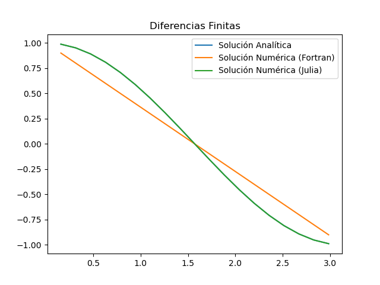

# Computación

Cosillas para algún curso de Computación

## Exámenes

### Examen 01

El código requerido se puede encontrar en dos versiones:

- [julia](./examen-01.jl) que es más moderno y utiliza operaciones con arreglos.
- [Fortran](./examen-01.f90) que pues es Fortran...

### Examen 02

- [Teoría](./examen-02-teoria.md)
- [Código en Fortran](./examen-02.f90) para la implementación de la solución.
- [Código en Julia](./examen-02.jl) para la comprobación.
- [Código en Python](./examen-02-plot.py) para la gráfica.
- [Resultados de Fortran](./resultados.dat) las columnas son x, solución numérica, solución analítica.
- [Resultados de Julia](./resultados-julia.csv) esta columna es solo los resultados de la solución numérica.

#### Resultados

